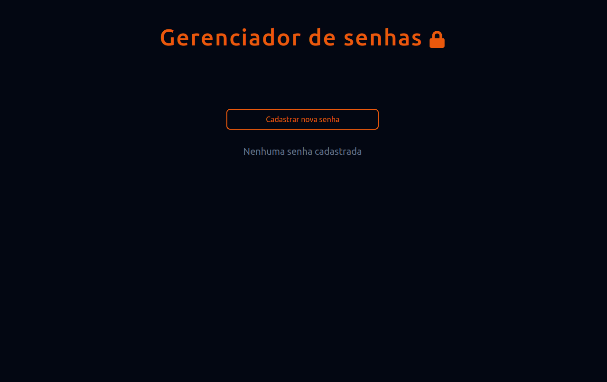
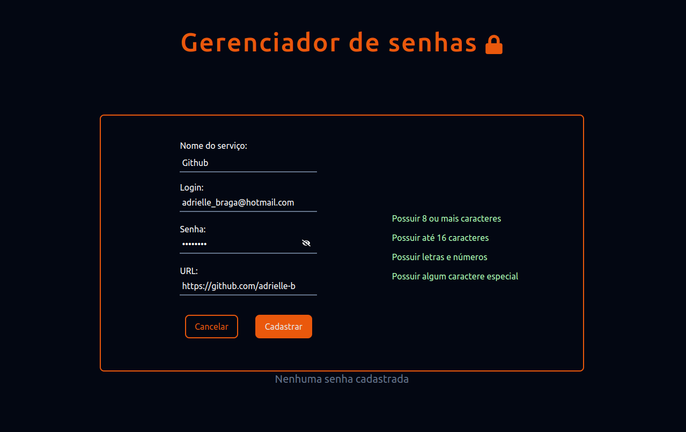

<h1>Gerenciador de senhas :lock:</h1> 

<h2>Descrição</h2>
Este é um projeto front-end gerenciador de senhas que foi desenvolvido com React, TypeScript e estilizado com Tailwind. Uma pessoa usuária pode cadastrar senhas para serviços que ela utiliza na internet, visualizar as senhas cadastradas, esconder as senhas salvas e remover os dados armazenados.

<h2>Funcionalidades</h2>

* Cadastro de senhas
* Alerta de cadastro com sucesso
* Visualização e ocultação de senha
* Remoção de senha cadastrada

<h2>Ilustração</h2>

  

  

